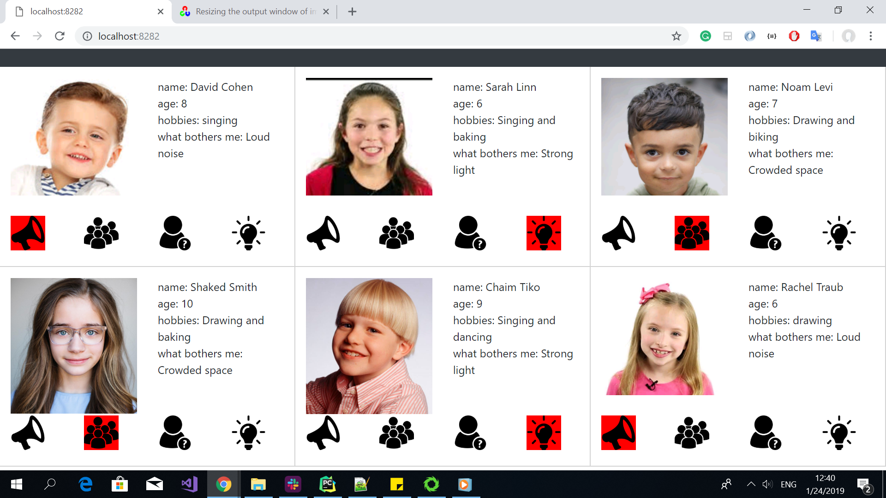
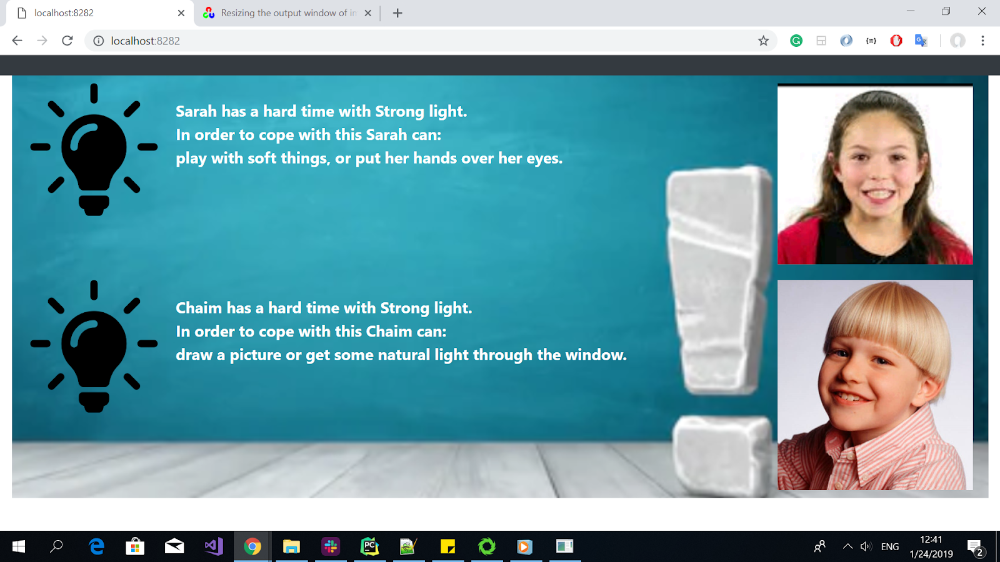

# Environmental Disorder Detection
An advanced system that detects environmental changes that cause mental breake downs for A.S.D children, and shows to the screen clear and practical solutions.   

* Orly Kierszenbaum
* Gitty Frenkel
* Yirat Ginsberg

## Screenshots

### Prerequisites
* Python 3.7 
* pipenv 

### Setup
* Clone this repo from github
* Install dependencies: `pipenv install`

### Run
To run this project use:
 * `pipenv run python websocket_pubsub.py`
 * `python manage.py add_to_db`
 * `python manage.py start`

## Credits and References
* NonZero - Udi Oron for helping with the socket code
